# flutter_arcgis_basemaps

This is a sample app showing how to load ArcGIS vector basemaps using a [free 
ArcGIS Platform account](https://developers.arcgis.com/sign-up/) and Leaflet.js using [flutter-vector-map-tiles](https://github.com/greensopinion/flutter-vector-map-tiles)


## Getting Started

Place a `api_key.dart` file within lib/src with the following content (replacing the API key)

```dart
// Create a free account: https://developers.arcgis.com/sign-up
// Grab the API from: https://developers.arcgis.com/api-keys/
final apiKey = '<your_API_KEY>';
```

## Clarifications

This project has to Widgets:

* MapScreen at `lib/src/leafletvector_screen.dart`: this one load a static map style from `lib/src/navigation_style.dart`
* MapScreenAsync at `lib/src/leafletvectorasync_screen.dart` which allows to set all map styles supported by ArcGIS using the values defined at `lib/src/arcgis_map_styles.dart`.

## Gallery of supported basemaps

<table>
    <tr>
        <td>
            <h5>arcgis-navigation</h5>
            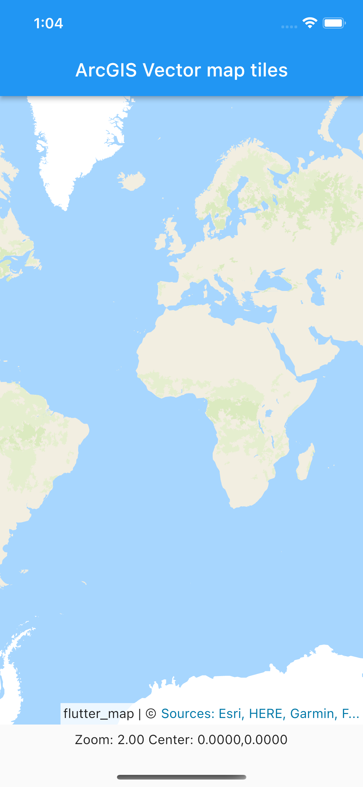
        </td>
        <td>
            <h5>arcgis-navigation-night</h5>
            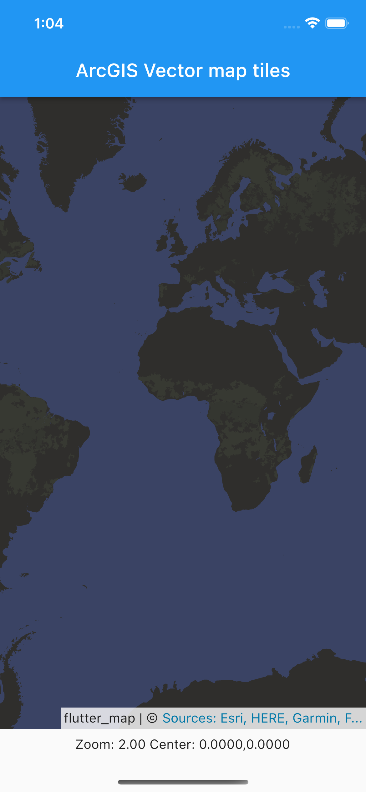
        </td>
        <td>
            <h5>arcgis-community</h5>
            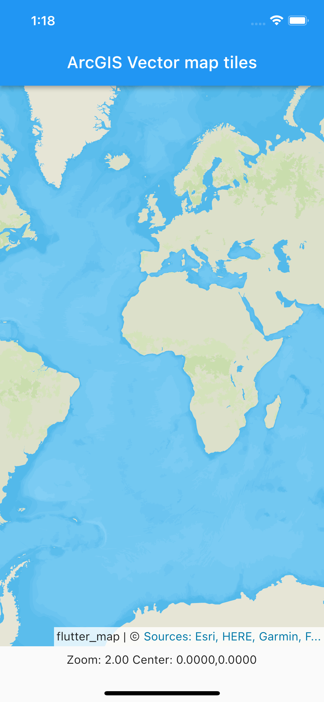
        </td>
    </tr>
    <tr>
        <td>
            <h5>arcgis-nova</h5>
            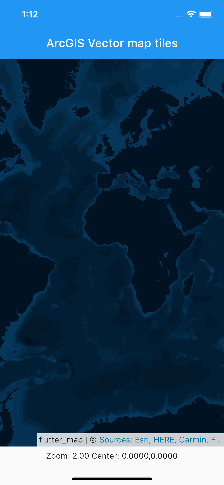
        </td>
        <td>
            <h5>arcgis-midcentury</h5>
            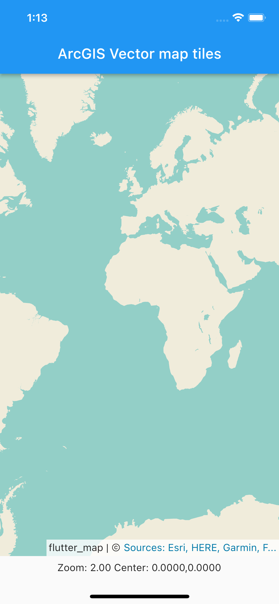
        </td>
        <td>
            <h5>arcgis-streets</h5>
            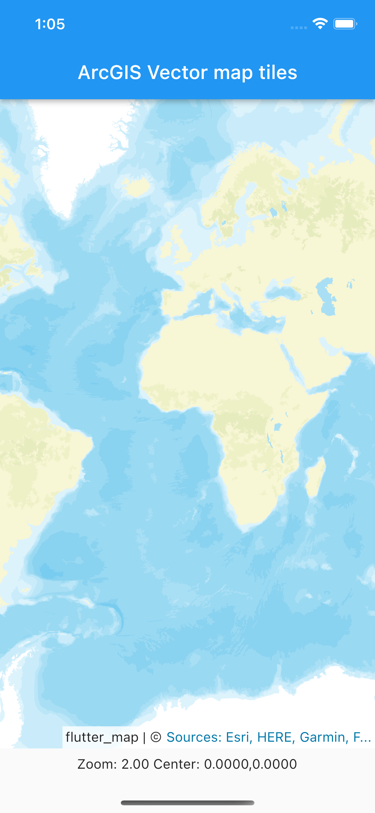
        </td>
    </tr>
    <tr>
        <td>
            <h5>arcgis-streets-night</h5>
            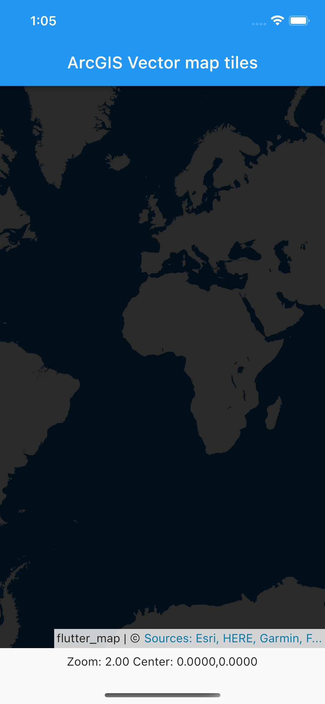
        </td>
        <td>
            <h5>arcgis-light-gray</h5>
            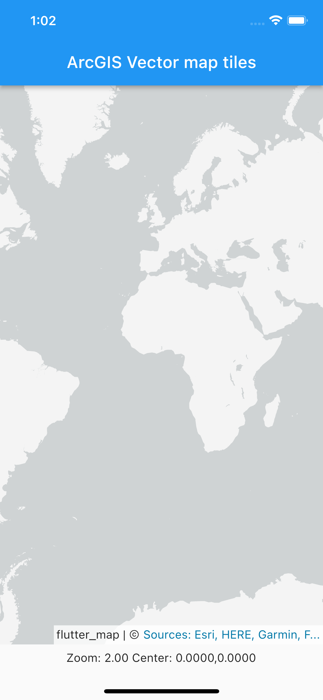
        </td>
        <td>
            <h5>arcgis-dark-gray</h5>
            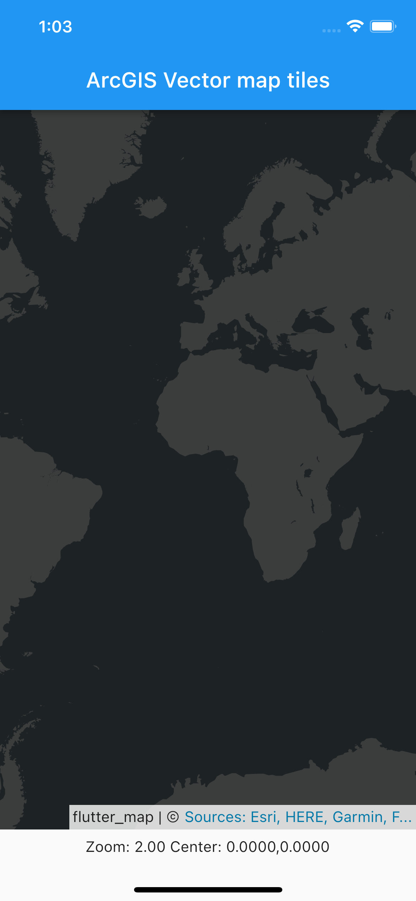
        </td>
    </tr>
    <tr>
        <td>
            <h5>arcgis-human-geography</h5>
            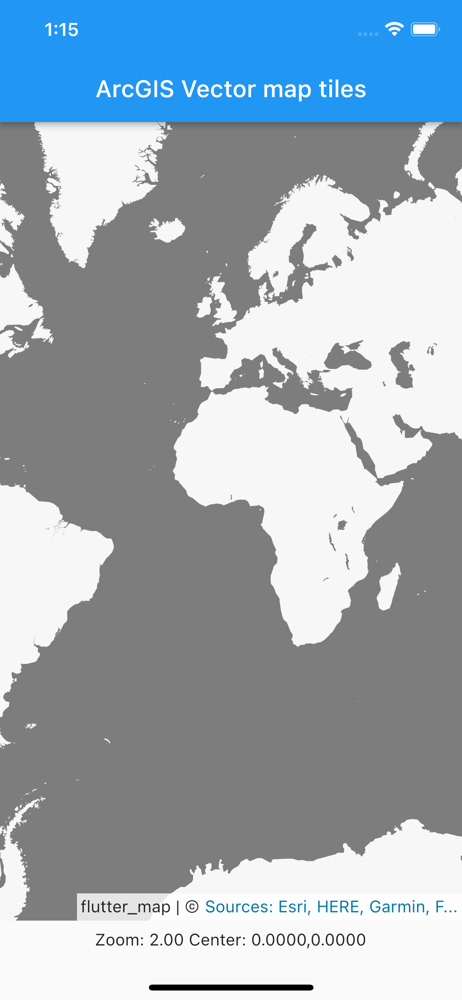
        </td>
        <td>
            <h5>arcgis-human-geography-dark</h5>
            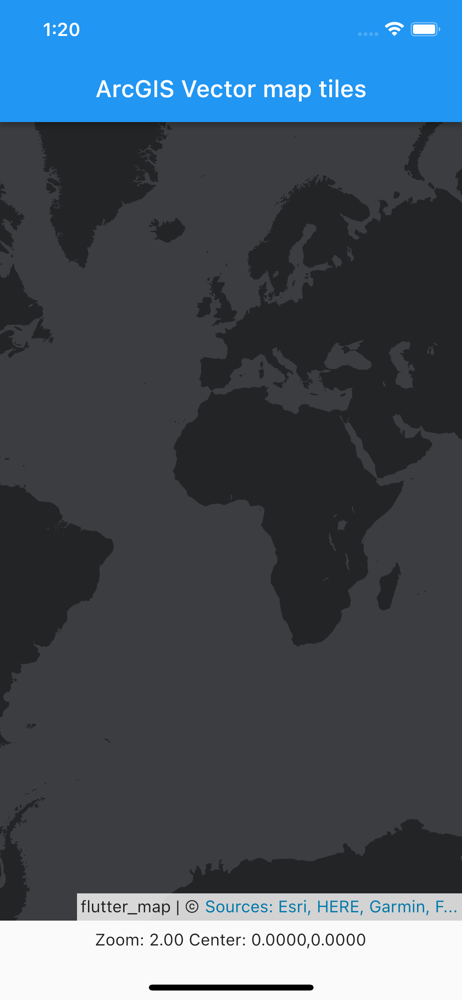
        </td>
        <td></td>
    </tr>
</table>

## Known issues

There are some limitations that needs to be overcome. Those are listed in the [project issues](https://github.com/hhkaos/flutter_arcgis_basemaps/issues).
