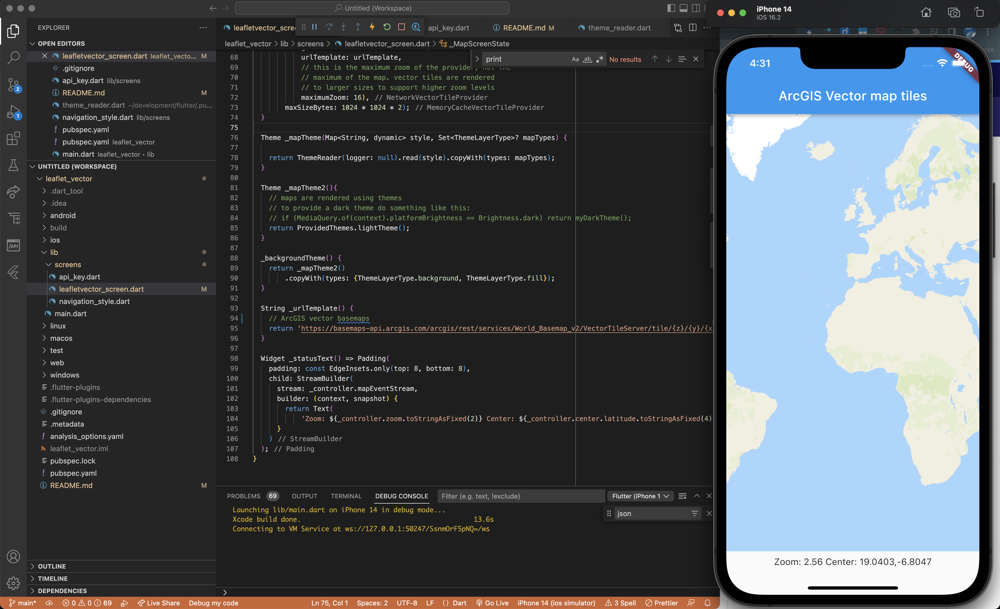

# flutter_arcgis_basemaps

This is a sample app showing how to load ArcGIS vector basemaps using a free 
ArcGIS Platform account and Leaflet.js



## Getting Started

Place a `api_key.dart` file within lib/screens with the following content (replacing the API key)

```dart
// Create a free account: https://developers.arcgis.com/sign-up
// Grab the API from: https://developers.arcgis.com/api-keys/
final apiKey = '<your_API_KEY>';
```